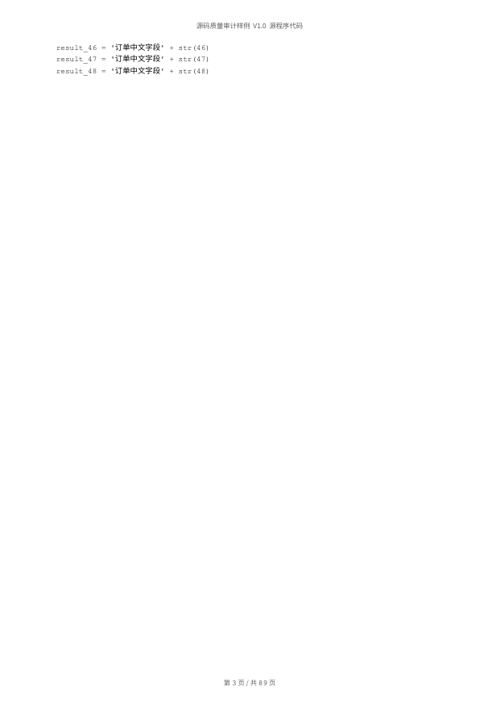
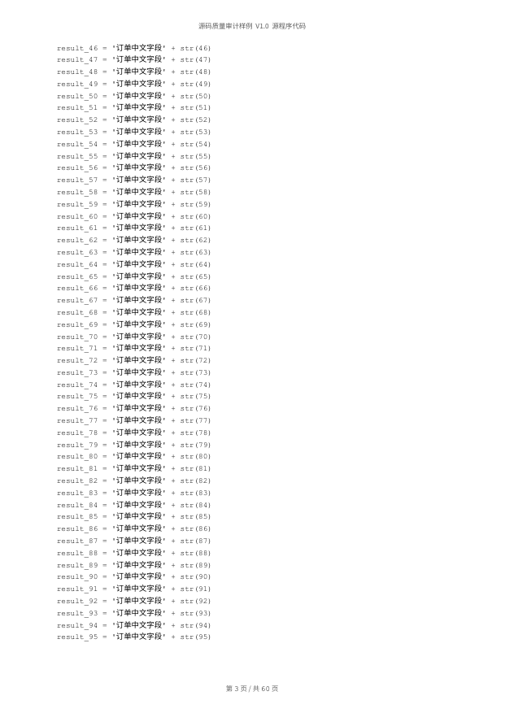
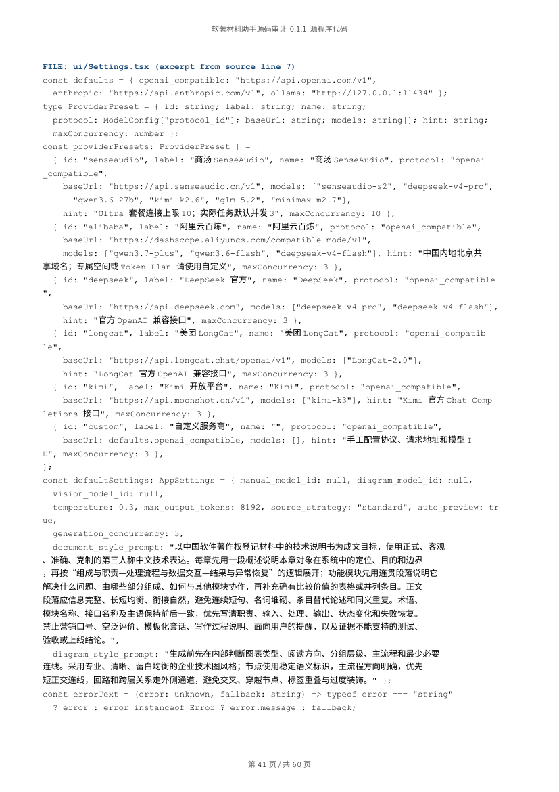
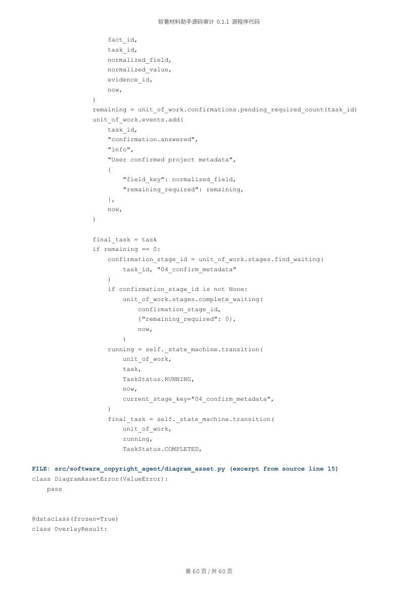

# 源代码材料审计证据

日期：2026-09-11。范围：源码筛选、分页、Word 生成、真实渲染、失败恢复和桌面导出。本文只记录本次已执行的检查。

## 已修复问题

| 问题 | 修复与验证 |
| --- | --- |
| 长文件路径及续摘标题未参与视觉宽度分页，预检为 59 页正文，Word 实际增页 | 文件标题与代码共用视觉宽度换行；分页规则更新到 `code-preview-v6`，旧预检需重新生成。8 层长包路径样例修复前渲染 89 页，修复后 60 页，稀疏页从 29 页降至 0 页。见 `before.json` / `after.json`。 |
| 源码筛选、分页失败后，服务与界面动作状态不允许原步骤重试 | 允许对应 `source_plan_error` / `code_preview_error` 恢复；文档或 QA 失败时也可重新分页。使用隔离数据库模拟一次输出失败后重试，复用同一扫描和筛选成果，成功清除 failure_category。 |
| 渲染失败后再次使用同一版本目录，旧页面可能混入新预览 | 先在干净临时目录完成 PDF 和 PNG 渲染，成功后替换页面集。回归验证长文档遗留页被移除、渲染中断不覆盖上次完整结果。 |
| 源码导出直接复制，未执行与手册相同的落盘回读校验；桌面命令可绕过界面 QA 门禁 | 源码导出复用 `write_verified_export`，完整性和当前 QA 状态均通过后才可导出。补充目录目标保护，避免把同名目录当成文件移动。Rust 测试验证替换已有文件后逐字节一致、无临时残留，以及无效目录仍保留原内容。 |





## 实际源码验证

从本项目的 Python、TS/TSX/CSS、Rust 源码复制到 `/tmp/copyright-source-audit/repository/project`，使用独立数据库和资产目录执行扫描、筛选、分页、DOCX 生成、真实 Word 渲染和 QA。本环节未访问模型，也未修改正式任务数据。

- 选中 71 个源码文件，共 30,240 行；文档实际取样 33 个文件，包含 Python、Rust 和 TypeScript TSX。
- 正文 59 页、每页 50 行；加封面后实际渲染 60 页。
- 当前产品 QA 19 项全部通过；空白页和正文稀疏页均为 0；最低正文填充比例为 0.8812。
- 内置字体检查涉及 480 个非 ASCII 码点，未发现缺字，也未依赖系统符号回退。
- 落盘文档 13,983,826 字节，SHA-256 与数据库记录一致；见 `repository-result.json`。
- 使用 documents 技能的 `render_docx.py` 独立生成第二套渲染结果，页数同为 60 页。
- 已查看 60 页排版联系表及第 2、41、58、60 页原图。原图检查中文、路径换行、页眉页脚、最后一页与右侧边界，未发现裁切、重叠或异常留白。全部原始 DOCX/PDF/PNG 留在 `/tmp/copyright-source-audit/`，未纳入 Git。





## 可重复执行

在仓库根目录运行；Python 需有项目依赖、LibreOffice 与 Poppler。生成物是明确标注的合成排版样例，不能作为真实项目申请材料。

```bash
PYTHONPATH=src python scripts/build_source_qa_fixture.py /tmp/source-audit/source.docx --render-dir /tmp/source-audit/render
PYTHONPATH=src python -m unittest discover -s tests -p 'test_code_preview.py'
PYTHONPATH=src python -m unittest discover -s tests -p 'test_source*.py'
cargo test --manifest-path src-tauri/Cargo.toml
```

本轮结果：分页相关 10 项、源码相关 19 项、Rust 15 项全部通过。新建复现脚本也已实际执行并得到 `qa_passed: true`。

## 验证边界

已验证 macOS 本地 LibreOffice/Poppler 真实渲染、当前源码样例、服务层恢复和 Rust 文件落盘逻辑。未把缩略图检查表述为 60 页逐字校对；本轮也未验证 Windows 安装版、Microsoft Word/WPS 打开、正式版权申报规则或操作系统原生另存为对话框。整体桌面交互验收由主审计继续完成。
